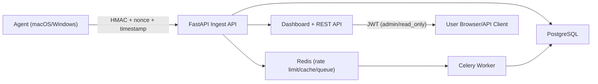

# Insight-first Endpoint Monitoring SaaS

Cloud-ready, privacy-first endpoint monitoring with signed agent ingest, server-side insight computation, fleet trends, and role-based dashboard/API access.

This platform is **not EDR**. It does not perform response actions (no process kill, isolation, or quarantine).

## Architecture



## Repo Layout

- `/Users/devano/Documents/GitHub/sec44/agent`: endpoint collectors, spooler, sender
- `/Users/devano/Documents/GitHub/sec44/core`: pure insight engine (baseline, scoring, dedup, deltas)
- `/Users/devano/Documents/GitHub/sec44/server`: FastAPI app, auth, ingest, dashboards, APIs, worker tasks
- `/Users/devano/Documents/GitHub/sec44/shared`: strict schemas, canonical JSON, HMAC signing, sanitization
- `/Users/devano/Documents/GitHub/sec44/alembic`: Postgres migrations

## Security Controls Checklist

- HMAC SHA-256 signing (`X-EM-Signature`) over canonical JSON
- Nonce + timestamp replay protection (`X-EM-Nonce`, `X-EM-Timestamp`)
- Per-org ingest rate limiting (configurable plan limits)
- Payload size cap (default 512KB)
- Strict Pydantic validation (`extra=forbid`)
- JWT Bearer auth (short-lived access + refresh)
- Role-based authorization (`admin`, `read_only`)
- Argon2 password hashing
- CSRF protection on state-changing cookie-auth routes
- Secure headers middleware (CSP, HSTS, X-Frame-Options, no-store)
- HTTPS enforcement middleware for staging/prod
- SQLAlchemy ORM parameterization (no raw SQL interpolation)
- Jinja autoescape enabled for dashboard rendering
- Structured JSON logging with secret redaction

## Threat Model

- Internet attacker against `/ingest`:
  - Mitigated by HMAC auth, replay checks, strict schema validation, rate limits, payload caps.
- MITM between agent and cloud:
  - Mitigated in deployment by TLS + HTTPS enforcement.
- Endpoint tampering attempts:
  - Agent is least-privilege, no remote command execution surface, no response actions.
- Credential theft attempts:
  - Dashboard uses Argon2 password hashes + short JWT TTL + refresh rotation.

## Privacy Model

Collected:
- Process metadata (`name`, `pid`, `exe`, `username`)
- Listener metadata (`ip`, `port`, process name)
- Auth outcomes (success/failure indicators)
- Persistence and scheduled-task metadata (path/task name only)

Not collected:
- Full command lines (default)
- File contents
- Credential material

Sanitization:
- Control characters stripped
- Field length limits enforced
- Email-like strings redacted

## Install

```bash
python -m venv .venv
source .venv/bin/activate
pip install -e '.[dev]'
```

## Environment Setup

Use `/Users/devano/Documents/GitHub/sec44/.env.example` as reference. Required variables include:

- `DATABASE_URL` (Postgres)
- `REDIS_URL`
- `EM_ORGS_JSON`
- `EM_USERS_JSON`
- `EM_JWT_ACCESS_SECRET`
- `EM_JWT_REFRESH_SECRET`
- `EM_CSRF_SECRET`

## Postgres Migration Commands

```bash
python -m server migrate
# or
alembic upgrade head
```

## Run (Local Cloud-like Stack)

### Server

```bash
python -m server run
# or
uvicorn server.app:app --host 0.0.0.0 --port 8000
```

### Worker

```bash
celery -A server.celery_app.celery_app worker --loglevel=info --concurrency=2
```

### Agent (macOS)

```bash
python -m agent init
python -m agent run-once
python -m agent daemon
```

### Agent (Windows)

```powershell
python -m agent init
python -m agent run-once
python -m agent daemon
```

## Docker Compose (Server + Worker + Postgres + Redis)

```bash
docker compose up --build
```

## Dashboard Auth Guide

1. Seed at least one dashboard user via `EM_USERS_JSON` or CLI.
2. Open `/login`.
3. Authenticate with org + username + password.
4. Access protected pages (`/overview`, `/fleet`, `/insights`, `/events`, `/devices`).

## API Reference (JWT protected)

- `POST /auth/api/login`
- `POST /auth/api/refresh`
- `GET /v1/metrics?org_id=...&device_id=...&page=...&page_size=...`
- `GET /v1/fleet/top?org_id=...&limit=...`
- `POST /v1/admin/users` (admin only)

## Ingest API (Agent auth)

- `POST /ingest`
- Required headers:
  - `X-EM-Org`
  - `X-EM-Device`
  - `X-EM-Timestamp`
  - `X-EM-Nonce`
  - `X-EM-Signature`

## Monitoring

- Prometheus endpoint: `GET /internal/metrics`
- Optional token guard: `X-Metrics-Token` header when `EM_METRICS_TOKEN` set

## Testing

```bash
pytest -q
```

Included tests cover:
- invalid signatures, replay, payload-limit abuse
- JWT auth + refresh rotation
- SQL injection-path safety checks
- rate limiting behavior
- baseline anomalies, driver attribution bounds, dedup suppression
- Windows auth collector graceful degradation
- fuzz-style invalid input handling (no server 500s)

## CI/CD

GitHub Actions workflow at `/Users/devano/Documents/GitHub/sec44/.github/workflows/ci.yml` runs:
- Ruff
- MyPy
- Bandit
- Alembic migration
- Pytest

## Staging vs Production Notes

- Production should set:
  - `EM_ENV=production`
  - `EM_ENFORCE_HTTPS=true`
  - `EM_DEV_ENABLE_DOCS=false`
- Never commit API keys/JWT secrets to source control.
- Use managed secrets (KMS/secret manager) in cloud deployments.
